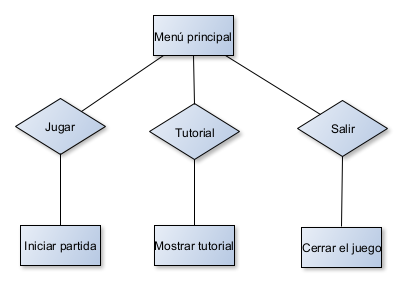
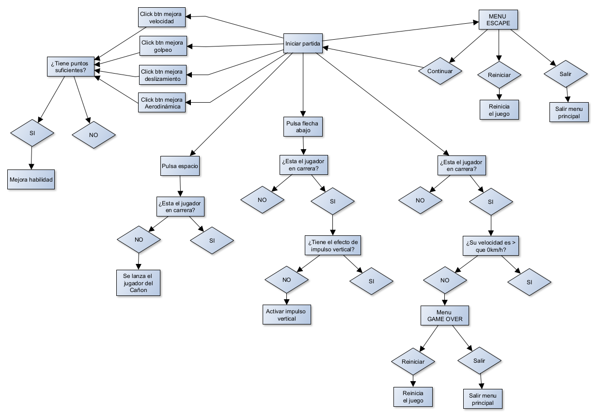

# CANNONMAN: ENDLESS-RUN

## GAME DESIGN DOCUMENT

Creado por: Martín Gago Chorén

Versión del documento: 1.0

## HISTORIAL DE REVISIONES

| Versión | Fecha      | Comentarios |
| 1.0     | 28/04/2024 | Creación y redacción del GDD  |

## RESUMEN

### Concepto

Cannonman: Endless-run es un juego singleplayer en el que manejamos la figura del famoso hombre bala o Cannonman. Nuestro objetivo es mejorar los atributos nuestro personaje para cada vez lograr un nuevo récord y superarnos a nosotros mismos alcanzando nuevas metas. La gracia del juego radica en que se trata de un juego infinito con progresión exponencial, lo que lo convierte en un juego adictivo sin fin. 

### Puntos Clave

Los puntos clave que hacen que Cannonman sea un juego adictivo que incentive al jugador a continuar jugando son:

1. **Sencillez de los controles:** Los controles simples permiten que jugadores de todos los niveles de habilidad puedan disfrutar del juego, desde aquellos experimentados hasta los más casuales que buscan pasar un rato divertido.

2. **Gestión de recursos:** A medida que el juego avanza, mejorar los atributos del jugador se vuelve cada vez más costoso, lo que obliga al jugador a tomar decisiones estratégicas sobre cómo invertir sus recursos para maximizar su progreso de manera eficiente.

3. **Crecimiento exponencial:** El progreso del jugador y la dificultad del juego aumentan de manera exponencial, lo que proporciona una sensación de logro gratificante cuando se alcanzan nuevos récords y metas que parecían inalcanzables anteriormente.

4. **Gameplay infinito:** Cannonman ofrece una experiencia de juego sin fin, donde el único límite es la determinación del jugador por superar sus propias marcas y alcanzar nuevas distancias.

5. **Variedad de obstáculos:** A lo largo del recorrido, los jugadores se encontrarán con una variedad de obstáculos y enemigos que desafiarán su habilidad y destreza. Además, hay elementos que ayudarán al jugador a superar los desafíos y avanzar aún más.

6. **Paisaje y entorno cambiantes:** Conforme el jugador avanza, el paisaje y el entorno se transforman, lo que sirve como indicador visual del progreso del jugador y añade variedad visual a la experiencia de juego.

7. **Juego multitarea:** Un punto clave es que este juego es compatible con realizar otras tareas (escuchar música, ver la televisión, realizar tareas monotonas) puesto que no requiere del 100% de la atención del usuario para poder jugarlo debido a la naturaleza del gameplay

### Género

`Aventura`, `Arcade`, `Gestión de recursos`, `Clicker`, `Endless-runner`, `Incremental-games`.

### Público Objetivo

El juego está dirigido a un público amplio y diverso, con un enfoque principal en jugadores casuales que buscan entretenimiento ligero durante tiempos muertos. El rango de edad al que se dirige abarca desde adolescentes de 16 años hasta adultos de 35 años, lo que refleja su accesibilidad y atractivo intergeneracional. No se hace distinción de género, ya que el juego está diseñado para ser disfrutado por cualquier persona interesada en una experiencia de juego relajada y adictiva.

El tipo de jugador al que se dirige son aquellos que prefieren actividades de ocio simples y poco demandantes, donde puedan disfrutar de la jugabilidad sin la presión de tener que prestar atención constante. Para los adolescentes, el juego puede ser una distracción divertida durante viajes en transporte público o en momentos de aburrimiento, aunque no recomendamos su uso durante clases. Para los adultos, el juego ofrece una forma fácil y rápida de desconectar durante pausas en el trabajo o en momentos de relax en casa.

Otros tipos de juegos que podrían interesar a este público objetivo incluyen otros títulos casuales y adictivos como juegos de puzzles, juegos de ritmo, simuladores simples, y juegos de gestión de recursos. Además, podrían disfrutar de juegos móviles similares que ofrecen una experiencia de juego rápida y gratificante para jugar en cualquier lugar y en cualquier momento.

### Experiencia de Juego

Cuando el jugador se sumerje en Cannonman: Endless-Run, experimentará una experiencia de juego emocionante y adictiva. Visualmente, verá a su personaje (Hombre bala) siendo lanzado desde un cañón, volando a través de paisajes coloridos y variados que cambian a medida que avanza. Los escenarios van desde un bosque hasta desiertos áridos o paisajes nevados, ofreciendo una variedad visual estimulante.

Los obstáculos y enemigos aparecerán en el camino del jugador, desafiándolo a esquivarlos. Desde simples rocas hasta rinocerontes en movimiento o abejas que intentarán entorpecerte. Cada elemento del entorno presenta una amenaza que pondrá a prueba los reflejos del jugador. Pero no todo es negativo; también hay elementos beneficiosos como trampolines que ayudarán al jugador, impulsándolo y proporcionándole una velocidad extra para alcanzar nuevos récords.

Auditivamente, el jugador será envuelto por una banda sonora enérgica y motivadora que añade dinamismo y emoción a la experiencia de juego. Además de esto, el juego ofrece una variedad de efectos sonoros que complementan la acción: desde el estruendo del cañón al dispararse, hasta los sonidos de impacto al chocar con obstáculos, el golpeteo al caer al suelo, y el zumbido de salir disparado por los aires tras un encuentro con un trampolín. Estos elementos auditivos trabajan juntos para sumergir al jugador en una experiencia inmersiva y emocionante.

En términos de jugabilidad, el jugador controla los movimientos de Cannonman con simples controles de teclado, utilizando la barra espaciadora para lanzarlo desde el cañón y la flecha hacia abajo para realizar impulsos verticales. A lo largo del juego, el jugador tendrá la oportunidad de mejorar los atributos de Cannonman, como velocidad, golpeo, deslizamiento y aerodinámica, lo que le permitirá alcanzar distancias aún mayores y superar sus récords anteriores.

En resumen, el jugador experimentará una emocionante carrera infinita llena de desafíos visuales y auditivos, donde cada partida ofrece la oportunidad de superarse a sí mismo y alcanzar nuevas metas.

## DISEÑO

### Metas de Diseño

1. Metas de ambientación:
    - Crear paisajes variados y visualmente atractivos que cambien a medida que el jugador avanza para dar feedback de progreso al jugador.
    - Utilizar efectos de sonido envolventes para aumentar la inmersión del jugador  cada vez que realiza una acción o sudece algún evento dentro del mundo del juego.

2. Metas de jugabilidad:
    - Diseñar obstáculos y enemigos desafiantes que requieran habilidad y reflejos por parte del jugador para superarlos y que obliguen al jugador a esquivarlos para evitar ser penalizado.
    - Diseñar un sistema de enemigos en base al nivel de progresión del jugador de forma que cuando más avanzado esté enemigos más peligrosos pueda encontrarse. (NO DISPONIBLE EN LA DEMO)
    - Generación aleatorio de los elementos interactivos (tanto aliados como enemigos) dentro del terreno de juego para evitar que todas las partidas sean iguales.
    - Implementar elementos de progresión, como mejoras de atributos, para motivar al jugador a continuar jugando y superando sus récords.
    - Proporcionar elementos de ayuda (trampolines) que incentiven al jugador a atreverse a asumir el riesgo de poder ser golpeado por un enemigo a cambio de ser impulsado por un trampolín.
    - Evitar pantallas de carga y otros menús para hacer el gameplay mucho más fluido y agradable para el jugador. (De hecho el menú de gameover tengo previsto eliminarlo, únicamente lo he puesto para cumplir con los requisitos de entrega)

3. Metas de interacción:
    - Desarrollar controles simples que permitan a los jugadores disfrutar del juego sin dificultad independientemente si están familiarizados con los videojuegos o no.
    - Incorporar elementos interactivos como trampolines que proporcionen al jugador ventajas estratégicas y añadan diversidad al gameplay.
    - Botones de mejora para los atributos del jugador que le ayudarán a alcanzar nuevas metas.

4. Metas de rejugabilidad:
    - Implementar sistemas de logros y desafíos que incentiven a los jugadores a regresar y explorar nuevas formas de jugar. (NO DISPONIBLE EN LA DEMO)
    - Ofrecer actualizaciones periódicas con contenido nuevo, como niveles adicionales o eventos especiales, para mantener fresca la experiencia del juego a largo plazo. (EN CURSO)

5. Metas de rendimiento y optimización:
    - Optimizar el rendimiento del juego para garantizar una experiencia fluida y sin interrupciones en una variedad de dispositivos tanto móviles como ordenadores de baja gamma. (EN CURSO)
    - Minimizar los tiempos de carga y optimizar los recursos para garantizar una experiencia de juego rápida eficiente.

## MECÁNICAS DE JUEGO

### Núcleo de Juego

En Cannonman: Endless-Run, las mecánicas del juego se basan en la acción de lanzar al personaje principal, Cannonman, desde un cañón y controlarlo a medida que avanza por un entorno infinito lleno de obstáculos y desafíos. Aquí se describen las principales mecánicas del juego y cómo interactúan entre sí:

#### Lanzamiento desde el cañón
- Regla: Al iniciar cada partida, el jugador lanza a Cannonman desde un cañón con velocidad inicial indeterminada.
- Funcionamiento: Para determinar la velocidad a la que sale despedido el jugador, éste deberá realizar una prueba de habilidad en el que deberá pulsar la tecla **barra espaciadora** en el momento de mayor potencia del cañon. La forma en la que se calcula la velocidad máxima con la que podrá salir despedido el jugador es gracias al atributo de `Velocidad` del jugador y al nivel que éste tenga.

El cálculo de la velocidad máxima proviene de la siguiente función matemática: 
`Base + Mathf.Pow(1.07f, Level) + (0.5f * Level)`
- Función matemática:
    - La velocidad base (`Base`) es un valor constante. Para el atributo de **velocidad** su valor es de: `32f`.
    - La `velocidad máxima cañon` se determina mediante una suma exponencial que depende del nivel del atributo de velocidad de Cannonman (`Level`). Esta suma exponencial se obtiene elevando el valor **1.07** a la potencia del **nivel** del atributo **velocidad**.
    - Además, se agrega un incremento lineal de 0.5 por cada nivel del atributo de velocidad.

El resultado de esta operación matemática proporciona la **Velocidad máxima cañon** a la que Cannonman puede ser lanzado. La velocidad mínima se establece como el `40%` de la **velocidad máxima cañon**, asegurando un rango de velocidad adecuado para el jugador.

#### Impulso vertical/Golpeo
- Regla: Siempre y cuando el jugador esté en el aire, éste podrá activar esta habilidad especial pulsando **Flecha abajo | DownArrow**; Esta habilidad impulsará al jugador verticalmente hacia abajo modificando su trayectoria y permitiendole esquivar enemigos, o alcanzar colchonetas. Esta habilidad sólo puede ser empleada una única vez en el aire y para poder volver a utilizarla es necesario tocar el suelo.
- Funcionamiento: Siempre y cuando se cumpla la regla anterior y el jugador tenga disponible el efecto de **impulso vertical** éste podrá pulsar la **flecha abajo** y se activará este efecto una única vez (La acción del pulsar repetidmente la acción no tendrá otros efectos mientras el impulso vertical esté activo). Cuando el jugado haya impactado con el terreno, o con alguna colchoneta, este efecto se reiniciará, permitiendo al jugador volver a activar la habilidad.  
El cálculo del **impulso vertical** o **golepo** del jugador se determina a través de una fórmula matemática en la que interviene: `Base golpeo`, `Nivel golpeo`, `Velocidad jugador`, y finalmente `Velocidad máxima cañon`.

El cálculo del impulso vertical proviene de la siguiente función matemática:  
`Base + [Mathf.Pow(1.045f, Level) * (Velocidad jugador/Velocidad máxima cañon)] + (Level * 0.2)`
- Función matemática:
    - El valor `Base` es un valor constante. Para el atributo de **golpeo** su valor es de: `11f`.
    - Sobre esta base, se aplica una suma que se calcula a través de realizar dos operaciones:
        - **Potencial**: Elevar el valor **1.045** a la potencia del **nivel** del atributo de **golepo**  `Mathf.Pow(1.045f, Level)` .
        - **Factor**: Dividir la velocidad actual del jugador con la velocidad maxima que el cañon puede expulsar al jugador. `Velocidad jugador/Velocidad máxima cañon`
        - **Caculo**: El valor que se le sumará a la `Base` será la suma entre el Potencial y el Factor calculados anteriormente: `Potencial + Factor`;
    - Finalmente se agrega un incremento lineal de 0.2 por cada nivel del atributo de golpeo.
El resultado de esta operación matemática proporciona el **impulso vertical** del jugador. Para hacer que este valor sea más estable y evitar errores, siempre que se aplica el **impulso vertical o golpeo**, la velocidad en el eje Y (Vertical) inicial se establece el 0, para evitar colapsamientos o anulaciones entre velocidades opuestas. 

#### Deslizamiento
- Regla: Cuando el jugador golpea el suelo éste le aplica al jugador una fricción penalizandolo con una ralentización en su velocidad de movimiento.
- Funcionamiento: Esta mecánica es simple pero crucial en el juego: al golpear el suelo, el jugador sufre las consecuencias.  Se aplica un efecto de fricción al terreno que reduce la velocidad del jugador, incluso llegando a detenerlo por completo. La capacidad de resistir esta fricción se puede mejorar mediante el atributo de `Deslizamiento`. Este atributo reduce la fricción del terreno, lo que permite al jugador mantener una velocidad más constante y evitar detenerse por completo al golpear el suelo. Veamos a continuación como escala el atributo de deslizamiento con la siguiente función:  
`Base - (Level * 0.04f)`
- Función matemática:
    - El valor de `Base` es un valor constante que representa la fricción inicial que tiene el terreno sobre el impacto de un jugador. El valor es la base es de `4f`.
    - Sobre esta base se aplica una resta, que se obtiene a través de un cálculo lineal del **Nivel deslizamiento** multiplicado por **0.04f**. `(Level * 0.04f)`
Este es el único atributo que adquiere un valor máximo o fin. Ya que dentro del motor de desarrollo, el valor de **friction** de un **material** no puede ser negativo. Es por ello que tal y como se han hecho las estadísticas, cuando el jugador alcance el `nivel 100` dentro del atributo de **Deslizamiento** se alcanzará su máximo valor de fricción que sería de 0, es decir, el jugador no sufre penalización al arrastrarse o golpear el suelo. 

#### Aerodinámica
- Regla: Mientras el jugador esté en el aire, o incluso arrastrándose por el suelo, se le aplicará un efecto de resistencia al viento (aerodinámica). Esta resistencia ralentiza la velocidad de movimiento del jugador, y su intensidad varía en función de la velocidad actual del jugador. Cuanto más rápido viaje el jugador, mayor será la ralentización aplicada, y cuanto más lento vaya, menor será el efecto de ralentización.
- Funcionamiento: Para calcular la ralentización aplicada al jugador, se utiliza una función matemática basada en un modelo logarítmico. Esta función logarítmica ajusta la ralentización de manera realista, de modo que a velocidades más altas se aplica una mayor desaceleración, mientras que a velocidades más bajas se aplica una desaceleración menor. Además, el efecto de la aerodinámica puede ser mejorado mediante el aumento del nivel del atributo de aerodinámica. En niveles avanzados, la mejora puede llegar a ser tan significativa que la desaceleración puede convertirse en aceleración, lo que significa que el jugador puede ganar velocidad en lugar de perderla con el tiempo.
A continuación se va a explicar la función que realiza este cálculo y que se aplica sobre el Rigibody2D del jugador:  
`Desaceleracion = Mathf.Log(VelocidadJugador + 1) * (Mathf.Abs(Factor) * 0.003f)`
- Función matemática:
    - `Factor`: es un valor calculado a través de realizar la siguiente fórmula en la que interviene el valor `Base` del atributo aerodinámica y el `nivel` que este tenga. Así el resultado de **Factor** se obtiene de la siguiente manera:  
    `Base - (Level * 0.1f)`. El valor de `Base` es siempre de **8f**, lo que quiere decir que en nivel 80 el factor será 0, y a partir de nivel 81 será negativo.  
    Sobre este factor vamos a aplicar una multiplicación por **0.003f**, esto es para ajustar el resultado final a las magnitudes de nuestro juego.
    - Para evitar errores matemáticos que interfieran con la lógica de nuestro juego, sobre el cálculo de `Factor * 0.003f` vamos a obtener siempre el número absoluto de este cálculo; Es decir, su valor positivo. Para saber si deberemos aplicar una aceleración o deceleración simplemente más adelante gestionaremos el valor original de `Factor` de forma que si es positivo se aplicará una **deceleración** y si es negativo se aplicará una **aceleración**.
    - Sobre la `Velocidad del jugador` se aplicará una función **Logarítmica** que nos permitirá adaptar el efecto deseado en base a la velocidad que tenga el jugador en cada actualización.
    - El `valor logarítimo velocidad jugador` se multiplicará por el valor absoluto de `Factor * 0.0003f`. El valor resultante será la **aceleración** o **deceleración** que aplicaremos sobre la **Velocidad jugaodor**.
- Aplicación de aceleración/deceleración:
    Tal y como se ha mencionado con anterioridad, si el valor de `Factor` es `positivo`, se aplicará una **ralentización**, es decir, el valor de **Desaceleracion** se restará en la velocidad de jugador por cada tick dentro del motor. Por otro lado, si el valor de **Factor** es `negativo`se aplicará una **Aceleración** en el jugador. Esto quiere decir que el valor de **Desaceleración** en lugar de restarse sobre la velocidad de jugador se sumará. Este efecto de aceleración se aplicará a partir de `nivel 81` del atributo de 

#### Ecala de costes de mejora

Todos los atributos o habilidades del jugador presentan el mismo volumen de escala exponencial. El cálculo del nuevo coste de mejora se calcula con la siguiente función matemática:  
`Coste base * Mathf.Pow(1.1f, Level Mejora)`  
Esta función se utiliza para calcular una progresión exponencial en el costo del juego, donde el costo base se multiplica por un factor de crecimiento (1.1) elevado al nivel actual del juego (**Level**). Esto resulta en un aumento gradual del costo a medida que el nivel del juego aumenta.

El valor Base de cada atributo de mejora es el siguiente:
- Velocidad: `25`
- Golpeo: `100` 
- Deslizamiento: `200`
- Aerodinámica: `400`

#### Obtención de puntos

- Regla: El jugador obtiene puntos en base a la distancia que éste ha recorrido en la run.
- Funcionamiento: La obtención de puntos por parte del jugador sigue una función linear, es decir, por cada metro que el jugador avanza, éste consigue 10 puntos. Los puntos que el jugador consiga en cada **Run** o carrera serán almacenados en un contador de **puntos**. Estos puntos son acumulables con otras carreras que el jugados haya hecho con anterioridad y sirven para mejorar los atributos/habilidades del jugador. Los puntos que el jugador vaya gastando a medida que avanza el juego se irán descontando de dicho contador, quedando únicamente los puntos disponibles que tiene para gastar en la **tienda de mejoras**.

#### Enemigos
- Regla: Tocar a los enemigos supone una penalización en la velocidad de movimiento del jugador
- Funcionamiento: Cada vez que el jugador toque el collider2D de cualquier enemigo, se le aplicará una penalización en su velocidad de movimiento. Dicha penalización variará atentiendo al tipo de enemigo con el que colisione. La fórmula a aplicar en las ralentizaciones es siempre un valor `base` + `porcentaje velocidad del jugador`.  
La forma en la que los enemigos aparecen en el terreno de juego es completamente aleatoria. Existe una serie de **spawns** en los que de forma aleatoria puede aparecer un tipo de enemigo de los diferentes posibles. Esto hace que cada **RUN** sea única y difernte a las demás.  
A continuación se detallan cuales son las ralentizaciones aplicadas al jugador según el enemigo con el que colisiona: 
    - Roca pequeña: `10f + 7% velocidad jugador`.
    - Abeja: `15f + 15% velocidad jugador`
    - Roca: `20f + 15% velocidad jugador`
    - Rinoceronte: `30f + 20% velocidad jugador`  

#### Aliados
- Regla: Tocar a los aliados ayudará al jugador proporcionandole un impulso en forma de velocidad calculado mediante una función matemática y en base a otros elementos externos como por ejemplo si el jugador tiene el efecto de `golpeo/impulso vertical` activado.
- Funcionamiento: Cada vez que el jugador golpea una colchoneta, se aplica una función similar a la aplicada con los enemigos: `base` + `porcentaje velocidad del jugador`. Pero existen 2 situaciones posibles cada vez que el jugador golpea la colchoneta:  
    - Rebote normal: El jugador golpea naturalmente la colchoneta sin haber realizado una acción especial. Para estos casos los valores que se aplican en la función son: `Velocidad Base de 15f + 10% velocidad del jugador`
    - Rebote con impulso: El jugador ha golpeado la colchoneta bajo el efecto de **golpeo** o **impulso vertical** en este caso el jugador recibe un **BONUS** en su impulso, siendo estos los valores aplicados en la función: `Velocidad base de 20f + 25% velocidad del jugador`.  
El rebote vertical hacia arriba que recibirá el jugador será porporcional al **impulso vertical**, esto quiere decir que con cuanta más fuerza vertical tenga el jugador en el momento de impactar con la colchoneta, más rebote y altura ganará el juagador.

#### Evolución de mapa
- Regla: Según el jugador vaya recorriendo metros en la run actual, el escenario por el que se mueve irá cambiando. A momento actual el cambio de escenario no supone ninguna ventaja o desventaja para el usuario, simplemente actúa como indicativo visual de cambio de fase.
- Funcionamiento: En base a la distancia recorrida por el usuario existen diferentes fases o escenarios que se activan de manera automática. Los escenarios existentes a momento actual son los siguientes:
    - Bosque: Escenario base. Este escenario va desde los `0m` recorridos hasta los `5.000m`.
    - Campo nevado: Es el segundo escenario del nivel. Este Escenario va desde los `5.001m` hasta los `25.000`.
    - Desierto: Es el tercer escenario del videojuego. El escenario abarca desde los `25.001m` hasta los `100.000`.
    - Cementerio: Es el escenario final del vieojuego. Este escenario se encuentra tras superar los `100.000m`. No existe un escenario superior, siendo éste el escenario final del videojuego. 

### Flujo de Juego
A continuación el grafo del menú principal del juego:  

Por otro lado este sería el flow graph de la interfaz del juego:  

### Fin de Juego

> *Explica, por medio de una lista, todas las maneras en las que puede concluir la partida. El orden debe ser el siguiente: primero las derrotas, luego las victorias y, al final, cualquier otra situación. En cada una de ellas, se debe describir lo que sucede en caso de que ocurra esa situación. Siempre debe haber una manera de dar fin al juego*

### Física de Juego

> *Explica la física del juego. Es decir, describe sobre qué elementos se aplica y cómo funciona la física que se ejerce en el universo del juego*

### Controles

> *Describe cuáles serán los controles a usar dentro del juego, tanto durante la partida como en el manejo de menú. Es recomendable utilizar una tabla y/o imágenes para indicar los botones a usar y sus funciones. En caso de haber más de un tipo de control, explícalos por separado*

## MUNDO DEL JUEGO

### Descripción General

> *Describe la apariencia básica y la sensación general del mundo en el que se desarrolla el juego. Añade cualquier información relevante con el fin de identificar la situación del jugador en el entorno*

### Personajes

> *Describe cada uno de los personajes que forman parte del juego. Indicar su nombre, apariencia, comportamiento y habilidades en caso de que las tenga. Sepáralos en 3 grupos, dependiendo de la existencia de ellos en el juego: Jugables, Secundarios y Enemigos. Es necesario incluir una imagen de cada personaje junto a su descripción*

### Objetos

> *Describe cada uno de los objetos que existen dentro del juego y pueden ser utilizados por el jugador. Escribe su nombre y su rINTERFAZ
### Flujo de Pantallas

> *Describe todas las pantallas del juego. Explica su apariencia general, los elementos de cada pantalla y la interconexión entre ellas. Es recomendable indicar primero la interacción de las pantallas usando un diagrama de flujo*

### HUD

> *Describe el HUD del juego durante el desarrollo de la partida. Todos los elementos que se muestran en ella deben ser indicados, incluyendo una descripción de su propósito. Es preferible incluir además una imagen con la composición gráfica conceptual de sus elementos*

> **HUD**: *acrónimo del término inglés Heads-Up Display (Presentación de Información). Conjunto de iconos, números, mapas, etc. que durante el juego nos dan información sobre el estado de nuestra partida y/o nuestro personaje, como por ejemplo vida restante, ubicación, munición, objetos en uso, etc.*

## ARTE

### Metas de Arte

> *Explica los objetivos que se quieren lograr en el arte del juego. Describe, de manera general, el estilo de arte aplicado además de indicar el concepto visual que se desea lograr en los elementos. Explica, por separado, el significado de la apariencia general de escenarios y personajes*

### Assets de Arte

> *Indica, en forma de lista ordenada, todas las imágenes y animaciones incluidas en el juego. Agrupa los assets por contenido relacionado. Por ejemplo, un personaje puede contener animaciones de salto, reposo, ataque, etc*

## AUDIO

### Metas de Audio

> *Explica el enfoque musical y sonoro del juego. Indica el objetivo general del audio dentro del juego y cómo se piensa alcanzarlo. También se debe describir, por separado, el concepto general de la música y los efectos de sonido del juego, incluyendo el silencio, en caso de haber un uso intencional de él*

### Assets de Audio

> *Indica, en forma de lista ordenada, todos los audios incluidos en el juego. Se debe agrupar los assets en dos grupos, Música y Sonidos. En el grupo Sonidos, internamente se debe agrupar en base al contenido en el cual es usado. Por ejemplo, un personaje puede contener sonidos de salto, golpe, muerte, etc*

## DETALLES TÉCNICOS

### Plataformas Objetivo

> *Indica las plataformas en las cuales sería publicado el juego. También se debe agregar cualquier especificación técnica que deba tener la plataforma para la normal ejecución del videojuego*

### Herramientas de Desarrollo

> *Indica todas las herramientas de desarrollo utilizadas para la creación del juego. Incluye el motor del juego y sus complementos, los programas usados en el arte y la música y cualquier otro programa usado durante su desarrollo*
